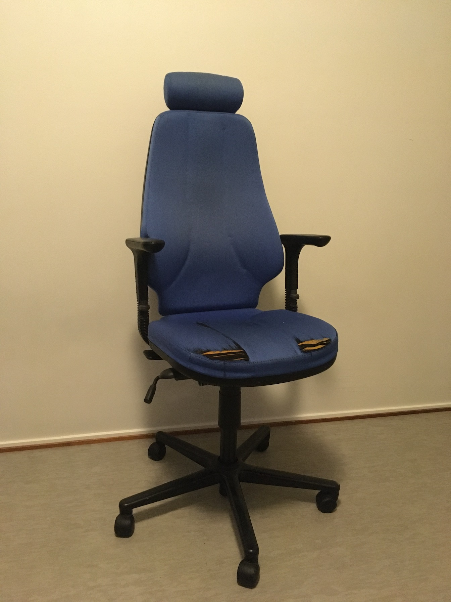
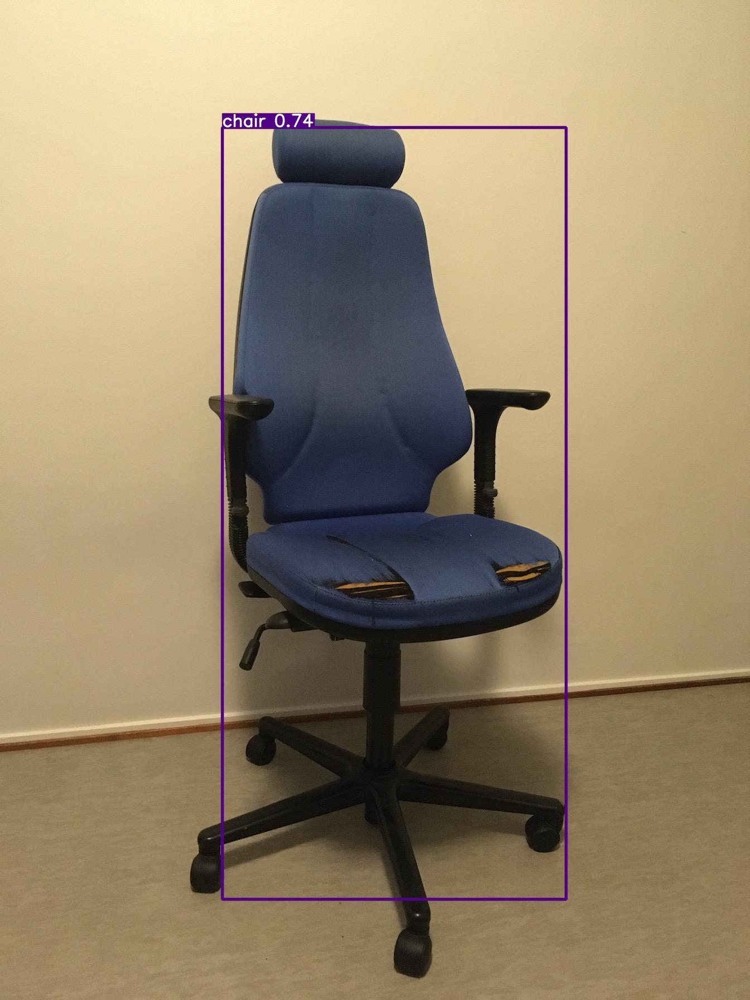

# Obtect

Obtect (OBject deTECTion) provides a simple API for detecting objects in images using [YOLOv5](https://github.com/ultralytics/yolov5). 

## Installation and Usage

### With Docker

```
docker pull amirzia7/ob:0.1.1
docker run -it -p 8000:80 amirzia7/ob:0.1.1
```

### Withut Docker

First, you need to start the server:

```bash
git clone https://github.com/amirzia/obtect.git && cd obtect
conda create --name obtect python=3.9
conda activate obtect
pip install -r requirements.txt
uvicorn obtect.api:app
```

Now the app is running on `http://127.0.0.1:8000`. You can send an image for object detection and get the result with this command:

```
curl -X POST localhost:8000/detect/ -F 'file=@<path to input jpeg file>' -o 'path to output file'
```

## Example
```
curl -X POST localhost:8000/detect/ -F 'file=@tests/test_images/input_chair.jpeg' -o out.jpeg
```

| Input | Output |
|---|---|
|  |  |

## Test

```
pytest
```

## Contributing
Pull requests are welcome. For major changes, please open an issue first to discuss what you would like to change.

Please make sure to update tests as appropriate.

## License
[MIT](https://choosealicense.com/licenses/mit/)
